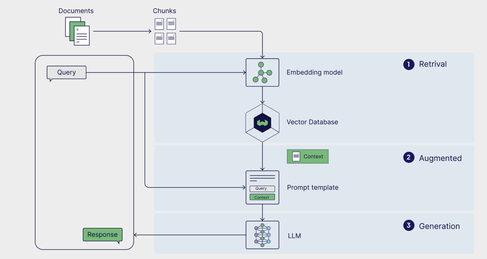

<!-- Python library -->
<div align="centre" >
  <h1 align="centre"> CARAG: A Powerful Python Library to Develop AI Applications with RAG Pipeline </h1>
</div>
  

[](https://www.python.org/dev/peps/pep-0008/)
[](LICENSE)


<div align="centre" >

<h8 align="left"> source: www.weaviate.com </h8>
</div>
  

## ✨ Description

**CARAG** is a Python library leverages a hybrid Retrieval-Augmented Generation (RAG) approach along with semantic cache (memory) to efficiently store and retrieve embeddings. By combining dense, sparse, and late interaction embeddings, It offers a robust solution for managing large datasets (unstructured text files) to get relevant grounded responses generated by the pre-trained LLMs from Mistral API.

## ✨ Features
🚀 **Hybrid RAG**: Utilizes dense, sparse, and late interaction embeddings for enhanced performance.  
🔌 **Easy Integration**: Simple API for storing and searching embeddings.  
📄 **PDF/CSV Support**: Directly store embeddings from PDF/CSV documents.  
🎉  **Ground Generation from LLM** Get synthesized responses from "mistral-large-latest".

<!-- Links -->
<p align="left">
  <a href="https://rizdelhi.medium.com" style="color: #06b6d4;"> Read more on the medium Blog</a> 
</p>

## 🌱 Getting Started
#### Prerequisites
- PyMuPDF
- Mistral
- fastembed
- qdrant_client
- ipywidgets

#### 🚀 Installation

To install **CARAG**, simply run: (latest version)

```bash
pip install carag==1.0.8
```
#### Set virtual environment 
```
python3 -m venv venv
source venv/bin/activate  # On macOS/Linux
venv\Scripts\activate  # On Windows
```
#### Install dependencies

```python

pip install -r requirements.txt

```
#### Create an .environment file
Create a file named .env in the root directory of your project. This file will store your API keys and other sensitive information.

```
import os
from dotenv import load_dotenv
load_env()

url=os.getenv(YOUR_QDRANT_URL)
api_key=os.getenv(YOUR_QDRANT_API_KEY)
mistral_api_key=os.getenv(YOUR_MISTRAL_API_KEY)

```

## 📦 Usage

```python
from carag import *
```

#### Initiate pipeline objects
> If there's no collection in the Qdrant DB, it creates collection name (e.g., collection_name='test')

```python

rag = rag_pipe(url="YOUR_QDRANT_URL", 
      api_key="YOUR_QDRANT_API_KEY",
      collection_name="YOUR_COLLECTION_NAME")

gg = GroundGeneration(
      url="YOUR_QDRANT_URL", 
      api_key="YOUR_QDRANT_API_KEY",
      mistral_api_key="YOUR_MISTRAL_API_KEY",
      collection_name="YOUR_COLLECTION_NAME",
      llm_model_name="MISTRAL_LLM_NAME",
      temperature=0.7, max_tokens=2000
)

# collection with the chosen name will be created, if not exists
```
#### upload text chunks to collection
> e.g., collection_name ="test"

**example data**
```python

text_chunks = [
    {
        "text": "The EU AI Act prohibits certain uses of artificial intelligence (AI). These include AI systems that manipulate people's decisions or exploit their vulnerabilities, systems that evaluate or classify people based on their social behavior or personal traits, and systems that predict a person's risk of committing a crime.",
        "metadata": {"source": "prohibited AI practice", "page": 1}
    },
    {
        "text": "Article 4 of the AI Act requires providers and deployers of AI systems to ensure a sufficient level of AI literacy to their staff and anyone using the systems on their behalf. The article entered into application on 2 February 2025. Several organizations have anticipated and prepared themselves",
        "metadata": {"source": "Article 4", "page": 2}
    },
    {
        "text": "Banned AI applications in the EU include: Cognitive behavioral manipulation of people or specific vulnerable groups: for example voice-activated toys that encourage dangerous behavior in children",
        "metadata": {"source": "unacceptable risk", "page": 3}
    },
]

# indexes & stores embeddings from a list of key,value pairs of text chunks - List[Dict]
rag_pipe.upload_text_chunks(
  url="YOUR_QDRANT_URL", 
  api_key="YOUR_QDRANT_API_KEY",
  text_chunks="YOUR_TEXT_CHUNKS,
  collection_name="YOUR_COLLECTION_NAME",
  batch_size=1
)
```
#### Get the top search result for the query (If the collection has embedding vectors stored in the vector DB)

```python
#### example:
top_k_scored_points = rag.invoke(url, api_key, "What are the key points of the European AI Act 2024?", 'test')

or

top_10_scored_points= gg.retrieve("What are the key points of the European AI Act 2024?", 'test',cache_first=True,top_k=10)
```
#### Get the top 3 responses / answers from the Mistral LLM

```python

top_responses = gg.grounded_generation_from_llm(query="your_query")
# temperature=0 precise; temperature=1 random
answers = top_responses['top_results']
print(answers)

```

### IMPORTANT NOTES

***ONLY Mistral AI LLMs are supported as of now.***

- **Qdrant** offers a free tier with 4GB disk space on cloud. To generate your API key and (URL) endpoint, visit [Qdrant](https://qdrant.tech/).

- **Mistral AI** offers a free tier with 1 billion tokens per month or 500K tokens per minute or 1 RPS.

## 🤝 Contributing  

Feel free to contribute to the improvement in the source code by reporting bugs, suggesting features, or submitting pull requests.

### QR code for feedback form and appointments

<div align="left" >

</div>


Don't forget to [star (🌟) this repo](https://github.com/rizwandel/Build-standard-RAG-with-Qdrant) to find it easier later.
